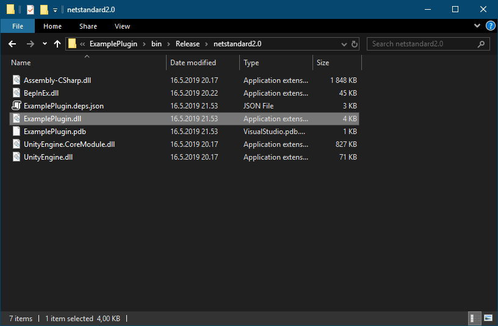
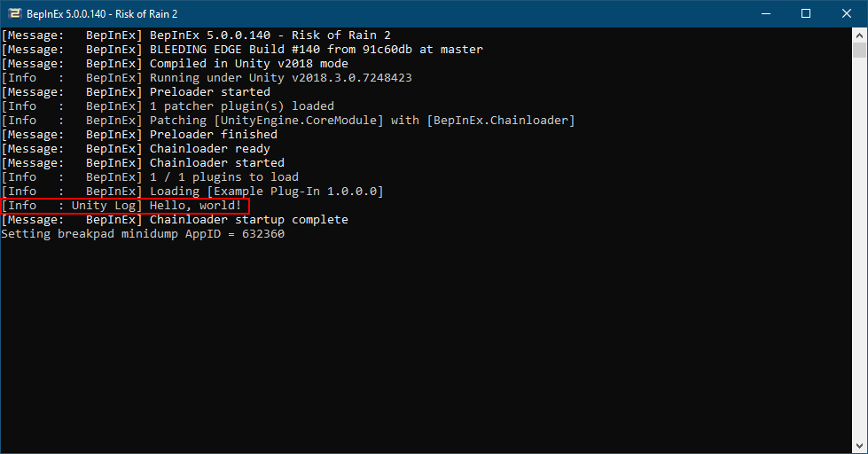

# Writing a basic plug-in

In this step we continue by writing code for a simple plug-in that displays a message in the console.

## Defining the plug-in class

Continuing from the previous step, rename `Class1.cs` to the name of your plugin. In this instance, we'll rename ours to `ExamplePlugin.cs`.

Open the source file. You'll see there is already some generic boilerplate code for a class.

Edit the class to inherit from @BepInEx.BaseUnityPlugin and add @BepInEx.BepInPlugin attribute to the class:

```csharp
using System;
using BepInEx;

namespace ExamplePlugin
{
    [BepInPlugin("org.bepinex.plugins.exampleplugin", "Example Plug-In", "1.0.0.0")]
    public class ExamplePlugin : BaseUnityPlugin
    {
    }
}
```

And that is everything you have to do in order for a class to be a valid plug-in! 
Note that the name of the namespace and the plug-in class are likely different in your case, so if you copy-paste, you might want to edit them.

Next, we'll dive a bit deeper into what all of this means.

## Specifying metadata with attributes

By itself, a simple class that inherits @BepInEx.BaseUnityPlugin doesn't tell BepInEx much. 
However, BepInEx has to know some information about the class in order to know how to load the plug-in. 
This is done by specifying C# attributes to the class as we defined above.

Let's go over some of the most important attributes you might want to use. 
For more attributes and exact documentation, visit the [API docs](~/api).

### Basic information about the plug-in

The most crucial attribute is @BepInEx.BepInPlugin. **Without it, BepInEx will simply ignore loading of the plug-in!**

The attribute consists of three string parameters that are:

| Parameter name | Description                                                                                                                                                                                                                                                                                                |
| -------------- | ---------------------------------------------------------------------------------------------------------------------------------------------------------------------------------------------------------------------------------------------------------------------------------------------------------- |
| `GUID`         | A unique identifier of the plugin. **It absolutely must be unique** as BepInEx uses it to detect duplicate plugins and sort dependencies. It is recommended (but not mandatory) to use the [reverse domain name notation](https://docs.oracle.com/javase/tutorial/java/package/namingpkgs.html) for GUIDs. |
| `Name`         | A human-readable name of the plug-in.                                                                                                                                                                                                                                                                      |
| `Version`      | Version of the plugin. The version format **must** be of the form `major.minor[.build[.revision]]` (i.e. a format that [System.Version](https://docs.microsoft.com/en-us/dotnet/api/system.version) can parse).                                                                                            |

Here's a simple example of the attribute:

```csharp
[BepInPlugin("org.bepinex.plugins.exampleplugin", "Example Plug-In", "1.0.0.0")]
public class ExamplePlugin : BaseUnityPlugin
```

### Specifying dependencies on other plug-ins

Sometimes you might want to load some plug-ins before other ones. 
Moreover, in some cases you want to ensure that a user has installed some other plug-in in order for yours to function.

You can specify dependencies on other plug-ins with @BepInEx.BepInDependency attribute.  
You can specify the attribute multiple times for multiple dependencies.

The attribute consists of only two parameters:

| Parameter name   | Description                                                                                                                                                                                                                                                                                                  |
| ---------------- | ------------------------------------------------------------------------------------------------------------------------------------------------------------------------------------------------------------------------------------------------------------------------------------------------------------ |
| `DependencyGUID` | The GUID of the plug-in that yours depends on. Must be in the exact same format and case as defined in the dependency.                                                                                                                                                                                       |
| `Flags`          | *Optional.* Specifies a flag from @BepInEx.BepInDependency.DependencyFlags that tells how to handle missing dependencies. A *soft dependency* means that the plug-in can be loaded even if the dependency is missing. A *hard dependency* means that a plug-in must be skipped if the dependency is missing. |

Here's a simple example of the attribute:

```csharp
[BepInPlugin("org.bepinex.plugins.exampleplugin", "Example Plug-In", "1.0.0.0")]

// A soft dependency. Loading won't be skipped if it's missing.
[BepInDependency("com.bepinex.plugin.somedependency", BepInDependency.DependencyFlags.SoftDependency)]
// A hard dependency. Loading will be skipped (and an error shown) if the dependency is missing.
[BepInDependency("com.bepinex.plugin.importantdependency", BepInDependency.DependencyFlags.HardDependency)]
// If flags are not specified, the dependency is **hard** by default
[BepInDependency("com.bepinex.plugin.anotherimportantone")]
public class ExamplePlugin : BaseUnityPlugin
```

### Filtering executables

In some cases you may want to allow to load the plugin only in certain games. 
For instance, your plug-in only works in one game and you want to prevent users from installing a plug-in into a wrong game.
Alternatively, there might be multiple games in the same game folder, and you want to load your plugin only in one of those games.

You can specify what games to load the plug-in on with @BepInEx.BepInProcess attribute.

The attribute has only one parameter: `ProcessName` that is simply the name of the process that the plug-in is allowed to run on (including the `.exe` extension).  
Naturally, you can specify the attribute multiple times.

An example of the attribute usage:

```csharp
[BepInPlugin("org.bepinex.plugins.exampleplugin", "Example Plug-In", "1.0.0.0")]
[BepInProcess("Risk of Rain 2.exe")]
[BepInProcess("AnotherGame.exe")]
public class ExamplePlugin : BaseUnityPlugin
```

## Adding code to the plug-in

Under the hood, @BepInEx.BaseUnityPlugin inherits from [MonoBehaviour](https://docs.unity3d.com/ScriptReference/MonoBehaviour.html).
This means you can access all game objects using Unity's own API.

As an example, we'll log `Hello, world!` text when the plug-in is starting. 
For that we'll add the call into [MonoBehaviour.Awake](https://docs.unity3d.com/ScriptReference/MonoBehaviour.Awake.html):

```csharp
[BepInPlugin("org.bepinex.plugins.exampleplugin", "Example Plug-In", "1.0.0.0")]
public class ExamplePlugin : BaseUnityPlugin
{
    // Awake is called once when both the game and the plug-in are loaded
    void Awake()
    {
        UnityEngine.Debug.Log("Hello, world!");
    }
}
```

## Compiling and testing the plug-in

Once the base code of the plug-in has been written, it's time to compile and test it.

To compile the plug-in, you can either use `Build > Build Solution` menu option or <kbd>Ctrl</kbd>+<kbd>Shift</kbd>+<kbd>B</kbd> shortcut.

Once the compilation is complete, you can find you plug-in DLL in `<Project Directory>\bin\Debug` (or `Release` if you built the release build). 
The name of the DLL is the same as the name of the project (not the source code file). Thus in the case of the project, the name of the plug-in DLL is `ExamplePlugin.dll`



To test the plug-in, move the plug-in DLL into `BepInEx\plugins\<Plug-in name>` folder in your target game.

> [!NOTE]
> It is not mandatory to put plug-ins into separate folders inside `BepInEx\plugins`, but it is **recommended**.
> Doing so will simplify installation and the removal process of each plug-in.

Finally, open up the game and gaze upon the BepInEx console:



Note that you have to enable the console via [the configuration file](<xref:configuration>) to see the debug message.

## Next steps

You can continue by adding more plug-ins or modifying the example plug-in!  
Remember that a single DLL can contain multiple plug-in classes: that is, you can add more classes that inherit from @BepInEx.BaseUnityPlugin and have the @BepInEx.BepInPlugin attribute and have multiple plugins in the same DLL.

Next, we'll look at how to create and manage configuration files of the plug-in.